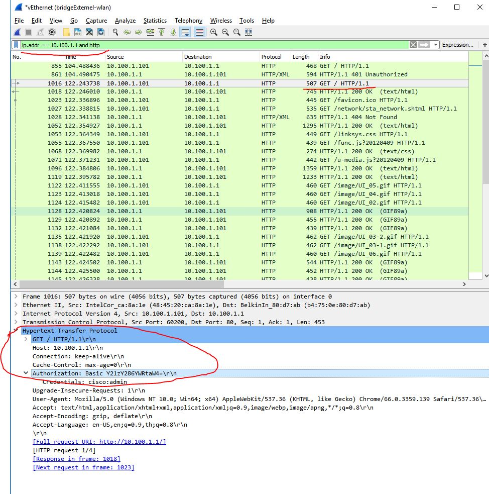

# request module to config device

เป็นตัวอย่างการใช้ module request เพื่อเรียก POST method(HTTP)  
โดยมีการทดลอง login หน้า web config ของอุปกรณ์ router (เป็น login แบบ basic authen) ดังรูป

จากนั้นทดสอบกดปุ่ม form บนหน้าเพื่อสั่ง config ซึ่งปุ่มดังกล่าวเป็นการสั่งยิง HTTP POST method แสดงการดักจับ package ด้วยโปรแกรม wireshark ได้ดังรูป

ซึ่งก็สามารถนำข้อมูลมาเขียนโปรแกรมเลียนแบบการ config ได้ดังโปรแกรม `lab4.py`
